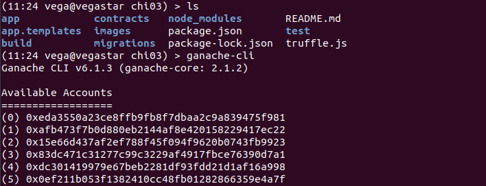

# CONSENSYS FINAL PROJECT - HOW TO RUN INSTRUCTIONS
## AUTHOR: Martin Lhotak
## STATUS: Final project submission (version 1.2)

## PREREQUISITES

For this project to work successfully, you will need to install:
	- node.js
	- node.js packages npm, web3, express, fs
	- truffle framework
	- ganache-cli client interface
	- configure ganache to run test network at port 8545

## 1 START BLOCKCHAIN AND DEPLOY SMART CONTRACT

1 Open up a new terminal and start blockchain test network
> ganache-cli

2 Open up a new terminal window and connect to the blockchain
> geth attach “http://localhost:8545”
This window can be used for torubleshooting and verifying the blockchain transactions

3 Open up a new terminal and copy the finalproject GitHub repository to local drive, you'll get the following directorty structure

4 Clean up smart contract repository 
> rm -r build/* -f

5 Now start the truffle develop environment and recompile the smart contract and libraries
> truffle develop
> truffle> compile

6 If all compiled without issues deploy the smart contract onto the test network
> truffle migrate

7 Look up the address of the deployed smart contract (see image above)

8 Now test the smart contract by running a truffle mocha test
> truffle test

If all works fine, 8 tests should pass.

## 3 APPLICATION EXAMPLE

1 Lunach the application server

2 Open browser and access the applicaiton server, a set of default menu items will compe up ina simple user interface screen

